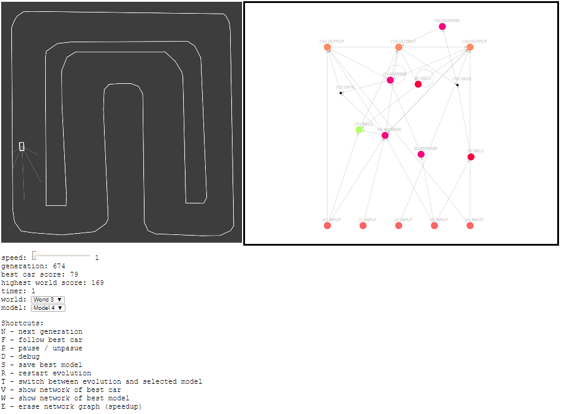
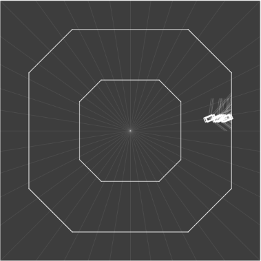
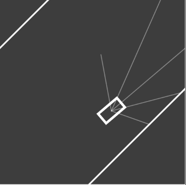
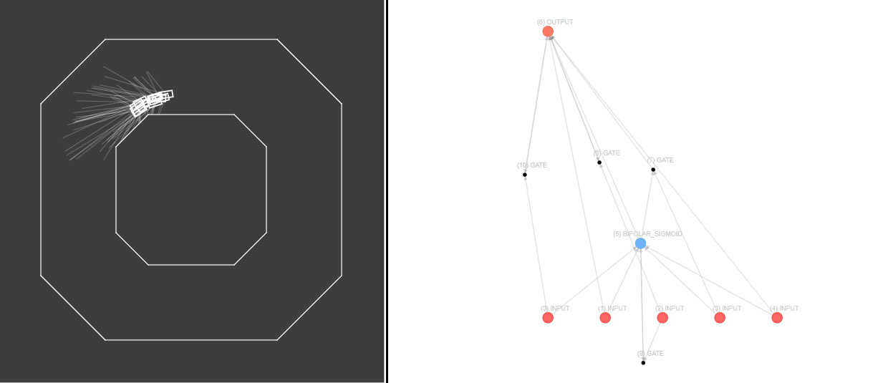
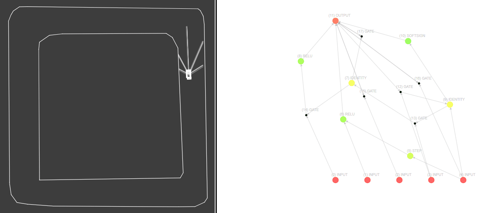
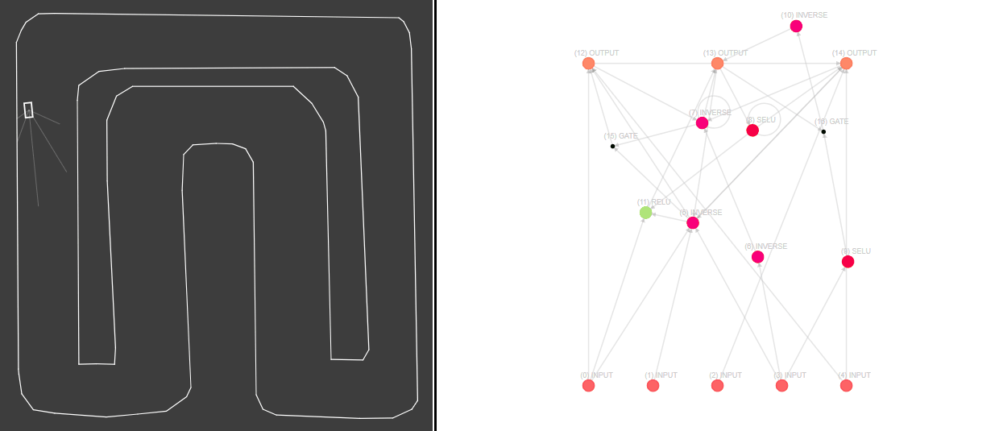

# Neuroevolution-Car

##### Celem projektu jest pobawienie się neuroewolucją i sprawdzenie jak sobie poradzi z problemem autonomicznej jazdy w bardzo prostym środowisku

### Symulator

Głównym elementem symulacji są samochodziki. Ich zadaniem jest przetrwać jak najdłużej na torze. W przypadku zetknięcia ze ściana są zatrzymywane, a ich punkty przestają być naliczne. Podstawową wiedzę o świecie czerpią z 5 czujników odelgłościowych o różnych długościach i ustawionych pod różnymi kątami. Wartości z czujników są wejściem do sieci neuronowej, a wyjście traktowane jest jako kąt skrętu. Samochody w obecnym projekcie mają stałą prędkość. 

Punkty przyznawane są za aktywny czas przebywania na torze, czyli za każdą kolejną klatkę w ruchu. Wcześniej wykorzystywałem do tego checkpointy w formie promieni rozłożonych równomiernie po planszy, jednak system ten jest zbyt dyskretny i skomplikowany w zastosowaniu dla trudniejszych torów.

Czujniki podają wartość minimalną ze swojej długość i odległości do najbliższej ściany

Samochód ma stałą prędkość i mówi jedynie o jaki kąt chciałby skorygować swoją obecną trasę. Samochody nie widzą siebie nawzajem.

### Panel

Opis funkcji panelu

* **speed** - służy do ustawiania prędkości symulacji (przydatne w trakcie ewolucji)
* **generation** - numer obecnej generacji
* **best car score** - najlepszy wynik spośród obecnie aktywnych samochodów
* **highest world score** - najlepszy ogólny wynik na danym torze w trakcie całej ewolucji
* **timer** - licznik czasu (jeśli populacja nie wymrze do danego czasu to jest siłowo ewoluowana)
* **track** - wybór torów
* **model** - wybór gotowych modeli do załadowania `T` (current oznacza najlepszy z całej ewolucji)

Skróty klawiszowe

* `N` - wymuszenie kolejnej ewolucji
* `F` - możliwość przybliżenia i śledzenia najlepszego obecnie pojazdu
* `P` - zatrzymywanie i starowanie symulacji
* `D` - pokazywanie informacji pomocniczych
* `S` - zapisywanie obecnie najlepszego modelu w formacie json. Załadowanie go do symulatora wymaga modyfikacji pliku `models.js`
* `R` - rozpoczęcie ewolucji od początku
* `T` - załadowanie wybranego modelu i uruchomienie przejazdu
* `V` - pokazanie grafu sieci neuronowej najlepszego z aktywnych samochodów
* `W` - pokazanie grafu sieci neuronowej najlepszego modelu z całej ewolucji
* `E` - wyczyszczenie grafu (przyspiesza symulację)

### Model

Ogólną ideą neuroewolucji jest generowanie sieci neuronowych włącznie z parametrami, topologią przy pomocy algorytmów ewoluchnych. 

Do samej neuroewolucji skorzystałem z biblioteki **[Neataptic](https://wagenaartje.github.io/neataptic/)**. Wykorzystałem ją, ponieważ opiera się na dokumencie [Evolving Neural Networks through Augmenting Topologies ](http://nn.cs.utexas.edu/downloads/papers/stanley.ec02.pdf), z którego planowałem skorzystać.

Szczegółowy opis działania biblioteki [Instinct: neuro-evolution on steroids](https://towardsdatascience.com/neuro-evolution-on-steroids-82bd14ddc2f6).

Wygenerowana sieć różni się od takich które znamy, a bardziej przypomina graf przepływów. Ogólnie istotniejsze są same komórki, a nie warstwy.

Ewolucja zaczyna się od prostej losowej sieci o 5 wejściach i 1 wyjściu. Następnie przeprowadzane są operacja krzyżowania i mutacji.

**Operacje mutacji**:

* dodawanie nowych komórek
* dodawanie połączeń pomiędzy komórkami
* dodawanie bramek (**gate**, dodatkowe połączenia)
* modyfikacja wag
* modyfikacja *bias*
* zmiana funkcji aktywacji
* usuwanie komórek, połączeń, bramek

**Operacja krzyżowania**

Na początku dziecko dziedziczy liczbę komórek po lepszym z rodzicu (w przypadku remisu po losowym). Następnie komórki są wybierane po kolei z losowego rodzica. Połączenia dzielone są na wspólne (występują w obu rodzicach) i dodatkowe. Ze wspólnej póli wybierane są losowo, a z dodatkowej tylko po lepszym rodzicu.

**Dodatkowe parametry:**

* rozmiar populacji: 20
* prawdopodobieństwo mutacji: 0.5
* elitaryzm: 5

Jednym z najwiekszych wyzwań w przypadku generowania sieci neuronowej jakie napotkałem jest potrzeba interpretowania wyjścia. Ze względu na dynamiczne zmiany w strukturze sieci zmienia się dziedzina wyjścia, którą w moim przypadku trzeba przełożyć na kąt skrętu. Rozwiązuje to przy pomocy odpowiedniego przycynania wartości wynikowej i rzutowania na inną skalę.

### Wyniki

#### Tor 1

#### Tor 2

#### Tor 3

